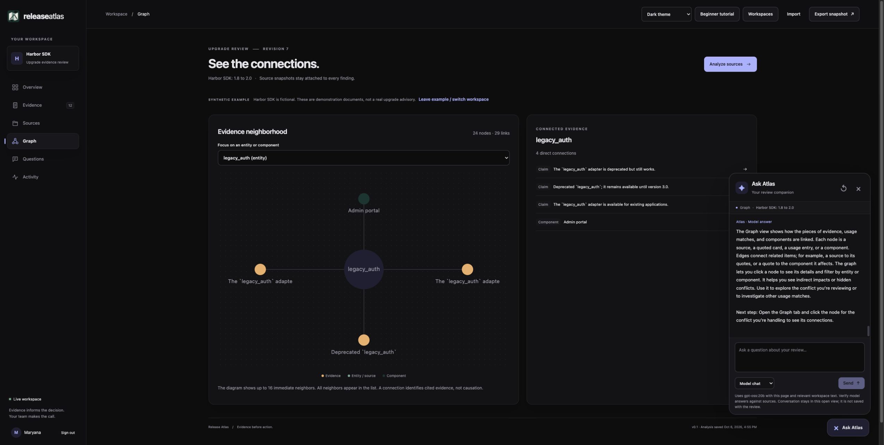

# Release Atlas

**Created by [Maryana Yurchyshyna](https://github.com/myurch).**

A collaborative workbench for reviewing software upgrade evidence. Bring versioned release notes and reference text, declare the APIs your application uses, inspect cited changes and conflicting guidance, and record a review with your team.

**Status: v0.1 local preview.** The Python service, responsive interface, analysis, retrieval, collaboration and contextual assistant are implemented and tested as described below. The Chromium CI suite covers live and standalone-file workflows; container execution remains unverified. This is not an enterprise security product or an upgrade-safety certification.



*The fictional Harbor SDK example: explore the `legacy_auth` evidence neighborhood, read its connected evidence, and get workflow guidance from Ask Atlas.*

## Hosted demo

[Open the interactive demo](https://maryanayurchyshyna.com/release-atlas/). Anyone with the link can explore it.

The hosted demo opens with the fictional Harbor SDK review already loaded. Explore all six pages, inspect evidence and graph connections, follow a prepared answer's citations, and try the beginner tutorial. Ask Atlas uses built-in **App guide** help. There is no live LLM connection, Python service, shared editing or new analysis on the demo site. Prepared tutorial decisions and answers are labeled as examples.

**Reset example** restores the sample review. Import and Export work in the current browser view; imported data is not sent to a backend. Refreshing returns to the original example. To run analysis, collaborate or connect Ollama, use the full application below.

`npm run build` produces both `dist/release-atlas.html` for the live service/file viewer and `dist/index.html` for static demo hosting. Serve the demo index through any static host. Its explicit build mode prevents API, session, event-stream and model requests even over HTTPS. The original live-service behavior is preserved.

## Try the application

Open `dist/release-atlas.html` in a modern browser and choose **Beginner tutorial** to learn with the included fictional Harbor SDK example. The file includes its JavaScript and CSS. This standalone mode can browse, import and export saved reviews. It cannot run Python analysis or synchronize with teammates. The UI keeps those technical mode details out of its main review workflow.

For the live workspace, use Python 3.14 and run these commands from this project directory:

```sh
python3 -m venv .venv
.venv/bin/python -m pip install -r requirements.txt
./start.sh
```

Open http://127.0.0.1:8765. Read the generated `.atlas/access-code` locally, enter it with a display name, then choose **Beginner tutorial**, or add your own source. The tutorial is also available from the sign-in screen without an access code. The code is generated once with owner-only permissions. The server stores workspace data in `.atlas/workspace.sqlite3`. Do not commit or share that directory. `Ctrl+C` stops the server; the workspace survives a restart. Sessions expire after 12 hours and reset on restart.

Python 3.14.4 and Node 26 were exercised on macOS. Node 22+ is required only to rebuild the frontend, not to run the included HTML or Python server. Initial dependency installation requires network access; model weights are not included or downloaded by this project.

## Appearance

The generated atlas-and-route logo is embedded in the interface and favicon. Its original PNG and full generation prompt are in `assets/`. The **Appearance** selector offers System, Dark and Light. System follows the browser/host preference and defaults to dark when neither preference can be determined. A manual choice persists locally when browser storage is available. No appearance setting changes the workspace or other reviewers.

Dark mode uses neutral near-black surfaces, with a separate high-contrast light palette. Shared hover, press, focus, panel and feedback transitions make interactions visible. The interface respects `prefers-reduced-motion`.

## Contextual help and Ask Atlas

Hover or keyboard-focus navigation, form fields, filters and actions for an explanation of what they do and why they matter. The small **?** controls beside key concepts also open help by click or keyboard. Escape dismisses help; the tooltip can be hovered and scrolled without disappearing.

**Ask Atlas** is available on every workbench page. It keeps a conversation as you move between Overview, Sources, Evidence, Graph, Questions and Activity. Its context indicator shows the current page and selected evidence or source.

- **Model chat** uses the configured generation provider, including Ollama `gpt-oss:20b`, to explain the workflow, answer general questions or discuss retrieved evidence. Its responses include clickable evidence when appropriate. Check the underlying passages; model answers can still be wrong.
- **App guide** provides immediate built-in explanations without a model request. It is also available in the standalone HTML viewer. It does not pretend to generate answers about arbitrary evidence.
- Chat is read-only. It does not add sources, record decisions, execute tools or save shared answers. Use **Questions** for answers that should become part of the review snapshot.
- Conversation is held only in the open browser view. Closing the panel or changing pages preserves it. Refreshing, signing out, importing a standalone snapshot or switching workspaces clears it. It is excluded from review exports. The tutorial hides and pauses live chat, preserving the conversation until you return.
- Enter sends a message; Shift+Enter adds a line. **Stop response** cancels waiting in this browser and keeps the question. A provider may finish its current call before another model request can start.

The server sends the selected page, workspace title, source titles/versions, declared usage, up to eight evidence excerpts and up to ten previous messages to its configured provider. No credentials or audit history are included. Requests and responses are bounded, authenticated and revision-checked. Citations must belong to the supplied evidence; known conflict partners travel together, and answers citing just one side of a supplied conflict are rejected. Stale analysis is excluded. Switching workspaces or losing the session prevents a pending result from being delivered. These checks do not establish semantic accuracy or eliminate prompt injection.

## Beginner tutorial

Choose **Beginner tutorial** in the toolbar, **Start beginner tutorial** in an empty workspace, or **Try the beginner tutorial** from the sign-in screen. The fifteen-step lesson starts with a concrete goal: decide what must be checked before upgrading the fictional Checkout service to Harbor 2.0.

The lesson explains sources, versions, claims, usage profiles, conflict candidates, review decisions, graphs, retrieval and citations in plain language. Its cursor moves to actual interface controls, clicks them and outlines the relevant result. **Next** advances at your pace. **Back** reconstructs the earlier example state; **Replay step** repeats the action. **Exit tutorial**, **Finish tutorial** or Escape returns to your previous screen, including unsaved form inputs. The tutorial uses prepared analysis and a labeled example answer. It does not write to the API, fetch feeds, call models or download exports.

Each lesson also includes **How this works**, connecting the action to the actual tooling and concept behind it. Examples include Python/scikit-learn NLP and NMF topics, TF-IDF/SVD statistical embeddings and logistic classification, technical entity extraction, NetworkX knowledge graphs, FastAPI/HTTPX data feeds, optional RAG/graph-assisted generation, Pydantic citation checks, TypeScript/React collaboration with SSE and SQLite, and evaluation against a keyword baseline. The explanations distinguish model suggestions from human decisions, explicit conflict rules from ML, and prepared tutorial outputs from live inference.

Reduced-motion preferences remove cursor travel and click animation. Tutorial controls remain visible while longer lesson text scrolls. Keyboard focus stays in the tutorial controls. A click/status caption describes actions without relying on the cursor alone.

The example conclusion is deliberately limited: investigate the two version 2.0 `retry_limit` passages, verify the supported setting and test retry behavior before proceeding. The 1.8 reference is historical context, and other findings still need review. A human review is not a certification of upgrade safety.

## Leave the example or switch workspaces

In a signed-in workspace, choose **Workspaces**, enter a name, then **New empty workspace**. The previous review remains saved. Select **Open** beside it in the same chooser to return later. A saved synthetic example also shows **Leave example / switch workspace** next to its label. Existing databases migrate automatically, preserving their active review, sources, notes and history.

The service keeps up to 30 named workspaces. The active selection is shared with everyone connected to that server. Creating or switching closes unsaved form inputs in the current view; save notes before switching. Each workspace retains its own audit history, while revisions increase across all switches so outdated writes cannot land in a different workspace. There is no delete operation in this preview.

**Import** in the signed-in interface creates a new saved workspace and preserves the previous one. If its title is already present, an `(import N)` suffix distinguishes it. In the standalone viewer, Import replaces only the current view after confirmation; use Export first to keep an unsaved imported snapshot. The tutorial itself never needs unloading from the server because its state is temporary.

## Review your own upgrade

1. Create a named workspace and add release notes or versioned reference text in **Sources**, including its permission/license and version.
2. In **Overview**, edit the usage profile with one `component | API_or_setting` pair per line, then **Analyze sources**.
3. Open **Evidence**, compare exact passages and follow source links. Category and usage matches are suggestions. Investigate conflicts before deciding.
4. Use **Graph** to follow a component to its settings and claims. In **Questions**, compare keyword, embedding and graph retrieval; the optional model checkbox drafts a cited answer.
5. Record a review decision and note. Other sessions receive updates. If a peer changes the workspace while you are writing, load the current review before saving again.
6. Check **Activity**, then **Export snapshot**. This JSON keeps sources, claims, graph, answers and review names together. Check its content and permissions before sharing.

Harbor SDK, all demonstration documents and training/evaluation examples are original synthetic fixtures, not advice about a real library. Imported names are provenance, not verified identity. Export preserves the current view, which can lag briefly during a reconnect; wait for the live connection before taking a final shared snapshot.

## Models and data flow

Generation defaults to Ollama at `http://localhost:11434` with `gpt-oss:20b`. Ollama must already be running with that model installed. New classification, topics, entity extraction and graph retrieval work without an LLM. The optional drafted answer and Ask Atlas Model chat call the configured generation provider. App guide and the tutorial do not.

Environment variables are documented in `.env.example`. The server does not automatically load that file. Example compatible endpoint:

```sh
ATLAS_LLM_KIND=compatible ATLAS_LLM_BASE=http://localhost:11434/v1 ATLAS_LLM_MODEL=gpt-oss:20b ./start.sh
```

Remote compatible endpoints must use HTTPS. Set `ATLAS_LLM_KEY` in the server environment if needed. Never put provider keys in browser code, source files or exported reviews. A remote provider receives the question and retrieved evidence, including source titles and versions. Model chat also sends the bounded conversation and current page/usage context described above. Response support is the documented nonstreaming JSON subset; not every service implements it identically.

Embeddings are a separate contract. Default retrieval and classification use TF-IDF with truncated SVD, a statistical latent semantic representation, not a neural encoder. Setting `ATLAS_EMBED_MODEL` enables the separate `ATLAS_EMBED_KIND`, `ATLAS_EMBED_BASE` and optional `ATLAS_EMBED_KEY` adapter. It checks row order, count, finite nonzero vectors and dimensions. Vectors are rebuilt per query, so cached vectors from different models are never mixed. The installed local endpoint returned HTTP 501 for embeddings; no external embedding model was downloaded or claimed as tested.

```text
Versioned text / bounded GitHub feed + declared usage
  -> hashed source snapshots
  -> exact line claims + LSA/logistic category suggestions + NMF topics
  -> identifier/source/claim/component graph + conflict candidates
  -> lexical, vector or graph-assisted evidence retrieval
  -> optional version-aware LLM answer with checked citation IDs
  -> human review + SQLite revision transaction + live SSE updates
  -> portable saved-review JSON
```

GitHub import accepts only `owner/repository`, uses the fixed public GitHub release API, and snapshots up to three nonempty release bodies. Enter the content's license or your permission to use it. A public repository is not, by itself, permission to redistribute its content. The integration test exercised `tj/commander.js`; its release text is not shipped here.

## Capability evidence

| Capability | Working implementation | Evidence and limits |
| --- | --- | --- |
| Python NLP and ML pipeline | `backend/nlp.py`, scikit-learn training and inference | 36 training and 18 separate evaluation examples; small synthetic domain |
| Embedding classification | TF-IDF, SVD, normalized vectors, logistic classifier | Macro-F1 1.0 on this fixture, equal to keyword baseline; not representative accuracy |
| Topic modeling | NMF groups current source claims | Four inspectable topics in the demo; labels are top terms, not a risk taxonomy |
| Entity extraction | Backtick, snake_case and camelCase technical identifiers | Four exact-set cases; not general person/place named-entity recognition |
| Knowledge graph/network analysis | Typed source/claim/entity/component links, degree and bounded traversal | Version-scoped conflict candidates and accessible neighbor lists |
| RAG / GraphRAG | Three comparable retrieval routes plus optional cited generation | Graph bridges retrieve claims for component names absent from the passages; not a universal graph advantage |
| APIs and data feeds | FastAPI JSON, GitHub release snapshots, two model protocols | Actual loopback HTTP, GitHub feed and both local generation routes exercised |
| TypeScript multiuser UI | React, SSE synchronization and retained draft revisions | Live browser tabs plus distinct API sessions; stale writes return 409 |
| Delivery and support | Locked dependencies, single HTML build, tests, launcher, container and CI recipes | Local rebuilds and hosted Chromium CI tested; Docker runtime remains unverified |
| Contextual assistance | `backend/assistant.py`, `frontend/Assistant.tsx`, `frontend/guide.ts` | Read-only page-aware chat, exact citation-ID checks, conflict-pair checks and built-in workflow fallback |

## Correctness and deployment boundaries

- Source text is immutable within its snapshot; SHA-256 and content identities are validated on import. Claim offsets use Unicode code points and must reproduce the exact quote. A source hash is integrity evidence, not an endorsement of its author or truth.
- Every write includes an expected revision. SQLite saves state and the latest 200 audit entries in one transaction. Long work checks the revision again before saving. The audit is bounded application history, not a tamper-proof compliance log.
- Adding sources or changing usage invalidates analysis. Reanalysis keeps reviews for stable claim IDs, recomputes suggestions and clears saved answers. Reviewers must reassess whether an earlier review remains appropriate after usage changes.
- Conflict detection is deliberately narrow: same exact semver-like version, shared identifier and opposing removal/support wording. It can miss negation, version ranges, synonyms and real-world nuance. No conflict found does not mean consistency or safety.
- Category scores are uncalibrated. Scores below 0.4 fall back to `other`. Even stronger scores can be wrong; the historical `legacy_auth` sentence illustrates limited contextual understanding. Human review remains necessary.
- The default is one loopback-bound Python worker, one shared workspace and a shared passcode. All signed-in members can edit. Display names are not verified accounts. This is for small trusted teams, not multitenant hosting.
- Sessions use HttpOnly/SameSite cookies; Host and write Origin are allowlisted. Source content renders as text. Provider URLs and secrets come only from server configuration. No browser-controlled URL proxy, model tools, code execution or repository mutation exists.
- Bounds: 30 sources, 12,000 code points per source, 300,000 source code points, 200 claims, 40 usage entries, 30 answers, 1.8 MB serialized workspace, 2 MB request/import, one analysis/query at a time, 40 event listeners and 100 sessions. Oversize analysis fails explicitly rather than truncating evidence.
- For remote or phone access, `localhost` names the device making the request. A phone must reach the host through a deliberately configured HTTPS reverse proxy. Set the exact HTTPS `ATLAS_ORIGINS`, use `ATLAS_COOKIE_SECURE=1`, protect the data directory and keep one worker. Never expose Ollama publicly. Remote proxy deployment has not been tested here.
- Dependency versions are locked for reproducibility, not a permanent security guarantee. This preview is not an independent security audit.

## Build and checks

```sh
npm ci
npm run typecheck
npm run format:check
npm run build
npm test
.venv/bin/python -m pytest -q
.venv/bin/python tools/evaluate.py
```

`npm run build` regenerates the deterministic synthetic snapshot, bundles React/TypeScript/CSS, retains bundled legal notices and writes one `dist/release-atlas.html`. No external fonts, CDN scripts or image requests are required; the generated logo is embedded once. `ATLAS_PYTHON` can override the build's Python executable. The standalone file itself is editable HTML, but changes should normally be made in `frontend/` and rebuilt.

Optional integration checks:

```sh
.venv/bin/python tools/live_probe.py
.venv/bin/python tools/integration_probe.py
npx playwright install chromium
npm run test:browser
```

The first command calls the configured local model through both protocols. The second uses an isolated workspace, real HTTP/SSE sessions and a public GitHub feed. The Playwright suite covers desktop/mobile, two contexts, export/import, direct file operation, keyboard help, motion preferences, assistant navigation, safe text rendering and stale chat suppression. It requires a working browser runtime. Shell-launched Chrome aborts in the original macOS sandbox, so the full suite runs in GitHub Actions on Linux; supported local Chrome interactions and module tests supplement that run. Safari/Firefox, real mobile hardware, WAN load and remote paid providers were not tested.

Recorded evidence lives in `validation/`. The evaluation result compares a keyword baseline and makes no claim that ML improved classification. Both real `gpt-oss:20b` adapters cited the two conflicting 2.0 passages and described the uncertainty. A valid citation ID alone cannot prove factual grounding. The reviewer is still responsible for reading the text.

Container recipe:

```sh
docker compose up --build
docker compose exec atlas cat /data/access-code
```

Compose binds the published port to host loopback and keeps data in a named volume. `host.docker.internal` refers to the host from the container, allowing access to host Ollama if its local configuration permits it. The container runs as UID 10001. Compose configuration was checked; the daemon was unavailable, so the image was not built or run. The CI workflow repeats the checks on GitHub; consult the repository Actions tab for its latest result.

## Troubleshooting and recovery

- **Cannot connect:** start `./start.sh`, use the printed port, and confirm no other process owns it.
- **Invalid access code:** read the configured data directory's access-code file, or use your explicit `ATLAS_ACCESS_CODE` value. Restarting clears sessions, not the stored review.
- **HTTP 400/403:** the browser origin/Host must match `ATLAS_ORIGINS`. Do not solve this by allowing arbitrary origins.
- **HTTP 409:** refresh/load the current review. Preserve or copy your draft before replacing it. Do not blindly retry an old write with a new revision.
- **Model failure:** keep the evidence, check the model/server configuration and retry. Rejected answers are not saved. Inspect sources directly while inference is unavailable.
- **Need another workspace:** use Workspaces to create an empty review or reopen an existing one. At the 30-workspace limit, existing reviews remain available; export needed snapshots, then stop the server and start with a different `ATLAS_DATA_DIR` for more space. Do not delete the original data directory.
- **Back up live data:** export through the UI/API or stop the server before copying `.atlas`. Do not copy an active SQLite main file alone while its WAL may contain newer transactions.

## Authorship and licensing

Release Atlas is an original personal project created by **Maryana Yurchyshyna** ([myurch](https://github.com/myurch)). The application-specific code and synthetic examples were developed for this project with AI coding assistance.

The original implementation and synthetic data are available under the [MIT license](LICENSE), copyright Maryana Yurchyshyna. Open-source dependencies retain their own authorship and licenses; bundled runtime credits are preserved in [THIRD_PARTY_NOTICES.md](THIRD_PARTY_NOTICES.md). The AI-generated logo has a separate [provenance record](assets/logo-provenance.json).

Primary implementation references: [Ollama chat](https://docs.ollama.com/api/chat), [Ollama embeddings](https://docs.ollama.com/api/embed), [Ollama compatible API](https://docs.ollama.com/api/openai-compatibility), [scikit-learn decomposition](https://scikit-learn.org/stable/modules/decomposition.html), [GitHub releases API](https://docs.github.com/en/rest/releases/releases), [FastAPI](https://fastapi.tiangolo.com/).
